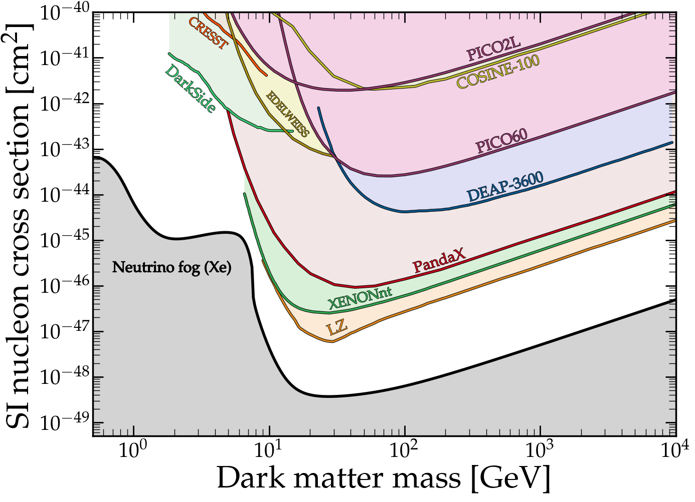

# How to make a plot

This is a repository containing code that I wrote for a lecture given at the [*2023 Annual Meeting of the Centre of Excellence for Dark Matter Particle Physics*](https://darkmatteraustralia.atlassian.net/wiki/spaces/CDMPublic/pages/1584562177/2023+CDM+Annual+Workshop+-+Collaboratively+striving+for+success) on the subject of how best to make effective figures for papers and talks in physics.

The repository focuses around specific examples of how to improve plots using Matplotlib. Click on any of the examples below to go to a jupyter notebook, or browse some in the /code folder. Most of the examples are made up, however they are inspired by the types of plots that people make in particle physics.

The slides to accompany this lecture can be found [here](slides) in both pdf and keynote formats. Reading them is probably important to understand to get the context behind why I made this repository. In the talk I went through some motivation behind making good plots, give some general design advice and highlight some common pitfalls, before going through a few specific tips for making good-looking figures using Matplotlib.

Please contact me at ciaran.ohare@sydney.edu.au if you have any questions, or spot any errors.

### Requirements

* [`Matplotlib`](https://matplotlib.org/)
* [`CMasher`](https://cmasher.readthedocs.io/)
* [`scipy`](https://scipy.org/)

---

# Notebooks

* [`code/Clutter.ipynb`](code/Clutter.ipynb) - Reducing clutter in figures with responsible use of pre-attentive attributes
* [`code/VisualClarity.ipynb`](code/VisualClarity.ipynb) - Improving visual clarity in line plots
* [`code/Defaults.ipynb`](code/Defaults.ipynb) - Changing matplotlib default settings and the use of style sheets
* [`code/MathematicalPlot.ipynb`](code/MathematicalPlot.ipynb) - Properly labelling plots containing mathematical formulae
* [`code/TablesVersusFigures.ipynb`](code/TablesVersusFigures.ipynb) - Turning tables into effective figures
* [`code/Histograms.ipynb`](code/Histograms.ipynb) - Attractive histograms
* [`code/ExclusionLimits.ipynb`](code/ExclusionLimits.ipynb) - Dark matter exclusion plots
* [`code/DarkMatterLandscape.ipynb`](code/DarkMatterLandscape.ipynb) - Dark matter landscape plot showcasing different math fonts
* [`code/ComplicatedPlots.ipynb`](code/ComplicatedPlots.ipynb) - How to clean up a complicated plot
* [`code/BoringPlots.ipynb`](code/BoringPlots.ipynb) - How to spruce up boring plots

---

 # Style sheets
* [code/sty.mplstyle](ode/sty.mplstyle) My preferred matplotlib style sheet (Palatino font)
* [code/sty2.mplstyle](ode/sty2.mplstyle) My preferred matplotlib style sheet (CM font)
* [code/sty3.mplstyle](ode/sty3.mplstyle) My preferred matplotlib style sheet (Sans-serif font)

# Image gallery

---